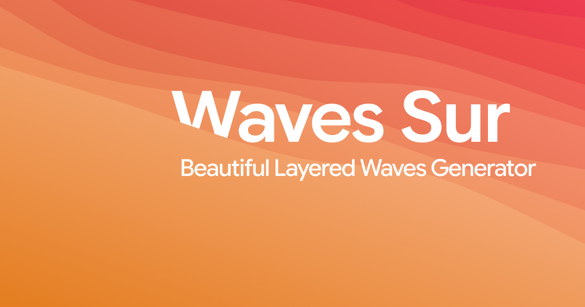

# Waves Sur

A small browser-based studio for making layered wave artwork. Choose a canvas, shape the composition, explore a color palette, and export the result without sending anything to a server.

[waves.wanakerta.com](https://waves.wanakerta.com/)

## What it can do

- Generate repeatable compositions from a numeric seed.
- Stack anywhere from 1 to 64 waves in a single scene.
- Adjust the wave rotation while keeping the composition deterministic.
- Start with wide, square, or portrait presets or enter a custom resolution.
- Adjust hue range, saturation, and lightness while previewing every change immediately.
- Keep custom colors in the browser.
- Switch between light and dark interface themes.
- Export the same composition as SVG, lossless PNG, or editable After Effects JSX layers.

The SVG, PNG, and After Effects exporters all use the same generated scene, so the artwork stays consistent between formats.
